# accounts.svc.plus Architecture

## Scope

`accounts.svc.plus` is the identity and account control service. It owns user authentication, session issuance, MFA, subscription state, admin settings, sandbox behavior, and agent registry endpoints.

## Architecture

```mermaid
flowchart TB
  subgraph Public["Public auth surface"]
    HZ["GET /healthz"]
    REG["POST /api/auth/register\nPOST /api/auth/register/send\nPOST /api/auth/register/verify"]
    LOGIN["POST /api/auth/login\nPOST /api/auth/mfa/verify\nPOST /api/auth/token/exchange\nGET /api/auth/oauth/login/:provider\nGET /api/auth/oauth/callback/:provider\nPOST /api/auth/token/refresh\nPOST /api/auth/refresh"]
    PUBLIC["GET /api/auth/mfa/status\nGET /api/auth/sync/config\nPOST /api/auth/sync/ack\nGET /api/auth/homepage-video\nGET /api/auth/sandbox/binding"]
    WEBHOOK["POST /api/billing/stripe/webhook"]
  end

  subgraph Session["Session protected"]
    SESSION["GET /api/auth/session\nDELETE /api/auth/session\nGET/PUT /api/auth/xworkmate/profile"]
    MFA["POST /api/auth/mfa/totp/provision\nPOST /api/auth/mfa/totp/verify\nPOST /api/auth/mfa/disable"]
    RESET["POST /api/auth/password/reset\nPOST /api/auth/password/reset/confirm"]
    BILLING["GET/POST /api/auth/subscriptions\nPOST /api/auth/subscriptions/cancel\nPOST /api/auth/stripe/checkout\nPOST /api/auth/stripe/portal"]
    SYNC["POST /api/auth/config/sync"]
    ADMINAUTH["GET/POST /api/auth/admin/settings\nGET/PUT /api/auth/admin/homepage-video"]
    USEROPS["GET /api/auth/users\nGET/POST /api/auth/admin/users/metrics\nPOST /api/auth/admin/users\nPOST /api/auth/admin/users/:userId/role\nDELETE /api/auth/admin/users/:userId/role\nPOST /api/auth/admin/users/:userId/pause\nPOST /api/auth/admin/users/:userId/resume\nDELETE /api/auth/admin/users/:userId\nPOST /api/auth/admin/users/:userId/renew-uuid"]
    ADMINMORE["POST /api/auth/admin/tenants/bootstrap\nGET/POST/DELETE /api/auth/admin/blacklist\nGET/POST /api/auth/admin/sandbox/binding\nPOST /api/auth/admin/sandbox/bind\nPOST /api/auth/admin/assume\nPOST /api/auth/admin/assume/revert\nGET /api/auth/admin/assume/status"]
  end

  subgraph Internal["Internal / agent surfaces"]
    INTERNAL["GET /api/internal/public-overview\nGET /api/internal/sandbox/guest"]
    AGENT["GET /api/agent-server/v1/users\nPOST /api/agent-server/v1/status\nGET /api/agent/nodes (legacy)"]
  end

  subgraph DB["PostgreSQL"]
    USERS[("users")]
    IDS[("identities")]
    SESSIONS[("sessions")]
    SUBS[("subscriptions")]
    SETTINGS[("admin_settings")]
    ROLES[("rbac_roles")]
    PERMS[("rbac_permissions")]
    ROLEPERMS[("rbac_role_permissions")]
    BLACKLIST[("email_blacklist")]
    AGENTS[("agents")]
    NODES[("nodes")]
  end

  REG --> USERS
  LOGIN --> USERS
  LOGIN --> IDS
  SESSION --> SESSIONS
  MFA --> USERS
  RESET --> USERS
  BILLING --> SUBS
  ADMINAUTH --> SETTINGS
  USEROPS --> USERS
  USEROPS --> ROLES
  USEROPS --> PERMS
  USEROPS --> ROLEPERMS
  ADMINMORE --> USERS
  ADMINMORE --> BLACKLIST
  ADMINMORE --> NODES
  AGENT --> USERS
  AGENT --> AGENTS
  AGENT --> NODES
  INTERNAL --> USERS
  WEBHOOK --> SUBS
```

## API Matrix

### Public auth and bootstrapping

| Name | Path | Purpose | Database / table | Auth mode |
| --- | --- | --- | --- | --- |
| Health | `/healthz` | Liveness check | N/A | none |
| Register | `/api/auth/register` | Create new account | `users`, `identities` | none |
| Register email | `/api/auth/register/send` | Send registration verification email | `users` | none |
| Register verify | `/api/auth/register/verify` | Confirm registration code / email | `users` | none |
| Login | `/api/auth/login` | Issue session token or MFA challenge | `users`, `sessions` | none |
| MFA verify | `/api/auth/mfa/verify` | Finish MFA login | `users`, `sessions` | none |
| OAuth login / callback | `/api/auth/oauth/login/:provider`, `/api/auth/oauth/callback/:provider` | OAuth entry and callback | `users`, `identities`, `sessions` | none |
| Token exchange | `/api/auth/token/exchange` | One-time OAuth exchange to session token | `sessions` | none |
| Token refresh | `/api/auth/token/refresh`, `/api/auth/refresh` | Refresh access token | `sessions` | bearer/refresh token |
| MFA status | `/api/auth/mfa/status` | Check whether MFA is required | `users` | none |
| Sync config | `/api/auth/sync/config`, `/api/auth/sync/ack` | Sync configuration snapshot / ack | `users`, `admin_settings` | none |
| Public homepage video | `/api/auth/homepage-video` | Read public homepage video config | `admin_settings` | none |
| Sandbox binding public read | `/api/auth/sandbox/binding` | Read sandbox node binding for guest/demo | `nodes`, `users` | none or session or internal token |

### Session protected account actions

| Name | Path | Purpose | Database / table | Auth mode |
| --- | --- | --- | --- | --- |
| Session | `/api/auth/session` | Read current session user | `sessions`, `users` | `Authorization: Bearer <session token>` |
| Logout | `DELETE /api/auth/session` | Revoke local session cookie / token | `sessions` | session token |
| XWorkmate profile | `/api/auth/xworkmate/profile` | Read/update per-user profile settings | `users`, `xworkmate_profiles` (migration-backed) | session token |
| MFA setup | `/api/auth/mfa/totp/provision`, `/api/auth/mfa/totp/verify`, `/api/auth/mfa/disable` | TOTP setup and disable | `users` | session token |
| Password reset | `/api/auth/password/reset`, `/api/auth/password/reset/confirm` | Reset password flow | `users` | session token |
| Subscriptions | `/api/auth/subscriptions`, `/api/auth/subscriptions/cancel` | Manage subscription records | `subscriptions`, `users` | session token |
| Stripe checkout / portal | `/api/auth/stripe/checkout`, `/api/auth/stripe/portal` | Open Stripe checkout and customer portal | `subscriptions`, `users` | session token |
| Config sync | `/api/auth/config/sync` | Push client config state | `users`, `admin_settings` | session token |

### Admin and operator actions

| Name | Path | Purpose | Database / table | Auth mode |
| --- | --- | --- | --- | --- |
| Admin settings | `/api/auth/admin/settings` | Read / update permission matrix | `admin_settings`, `rbac_*` | session token + admin/operator |
| Homepage video admin | `/api/auth/admin/homepage-video` | Update homepage video settings | `admin_settings` | session token + admin/operator |
| User metrics | `/api/auth/admin/users/metrics` | Count and summary of users | `users` | session token + admin/operator |
| Create user | `/api/auth/admin/users` | Create custom user | `users`, `sessions` | session token + admin/operator |
| Update role | `/api/auth/admin/users/:userId/role` | Change a user role | `users` | session token + admin/operator |
| Reset role | `DELETE /api/auth/admin/users/:userId/role` | Reset a user role | `users` | session token + admin/operator |
| Pause / resume | `/api/auth/admin/users/:userId/pause`, `/api/auth/admin/users/:userId/resume` | Disable / re-enable user | `users` | session token + admin/operator |
| Delete user | `DELETE /api/auth/admin/users/:userId` | Delete user | `users`, `sessions`, `identities` | session token + admin/operator |
| Renew proxy UUID | `/api/auth/admin/users/:userId/renew-uuid` | Rotate proxy UUID | `users` | session token + admin/operator |
| Tenant bootstrap | `/api/auth/admin/tenants/bootstrap` | Bootstrap tenant records | `tenants`, `tenant_memberships` (migration-backed) | session token + admin/operator |
| Blacklist | `/api/auth/admin/blacklist`, `/api/auth/admin/blacklist/:email` | Manage blocked email list | `email_blacklist` | session token + admin/operator |
| Sandbox binding admin | `/api/auth/admin/sandbox/binding`, `/api/auth/admin/sandbox/bind` | Bind sandbox node | `nodes`, `users` | session token + root/admin rules |
| Assume sandbox | `/api/auth/admin/assume`, `/api/auth/admin/assume/revert`, `/api/auth/admin/assume/status` | Switch to / from sandbox identity | `sessions`, `users` | session token + root-only allowlist |
| Users list | `/api/auth/users` | List users | `users` | session token + auth middleware |

### Internal and agent endpoints

| Name | Path | Purpose | Database / table | Auth mode |
| --- | --- | --- | --- | --- |
| Internal overview | `/api/internal/public-overview` | Public overview for internal clients | `users`, `admin_settings` | `X-Service-Token` |
| Sandbox guest | `/api/internal/sandbox/guest` | Return guest/demo identity snapshot | `users`, `nodes`, `sessions` | `X-Service-Token` |
| Agent users | `/api/agent-server/v1/users` | Provide Xray client list to agent runtime | `users`, `agents`, `nodes` | `Authorization: Bearer <agent token>` + optional `X-Agent-ID` |
| Agent status | `/api/agent-server/v1/status` | Receive agent heartbeat and sync status | `agents`, `nodes` | `Authorization: Bearer <agent token>` + optional `X-Agent-ID` |
| Legacy agent alias | `/api/agent/nodes` | Backward-compatible alias for node list | `nodes` | same as agent-server |

### Webhook

| Name | Path | Purpose | Database / table | Auth mode |
| --- | --- | --- | --- | --- |
| Stripe webhook | `/api/billing/stripe/webhook` | Receive Stripe events | `subscriptions` | Stripe signature verification |

## Data Model Notes

- `users` is the main identity record and also stores roles, groups, permissions, MFA state, proxy UUID, and activity flags.
- `identities` links OAuth providers to users.
- `sessions` stores session tokens with expiry.
- `subscriptions` stores billing state and provider references.
- `admin_settings` stores a versioned permission matrix.
- `rbac_roles`, `rbac_permissions`, and `rbac_role_permissions` store the RBAC catalog.
- `agents` stores agent runtime status snapshots.
- `nodes` stores proxy / node inventory.
- `email_blacklist` stores blocked addresses.
- The codebase also defines migration-backed tenant / XWorkmate models such as `tenants`, `tenant_domains`, `tenant_memberships`, and `xworkmate_profiles`; those tables are part of the broader account domain even though they are not declared in the checked-in `sql/schema.sql` snapshot.

## Auth Layers

1. Public routes do not require a session token.
2. Session protected routes require `Authorization: Bearer <session token>` and active-user validation.
3. Admin routes add role / permission checks on top of session auth.
4. Internal routes require `X-Service-Token`.
5. Agent routes accept agent credential tokens and optional `X-Agent-ID`.

## Notes

- Some frontend BFF endpoints use the same account service backend but shape cookies and auth state for browser usage.
- `api/agent-server/v1/*` is the canonical route family for the console and agent runtime.
